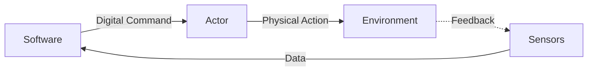
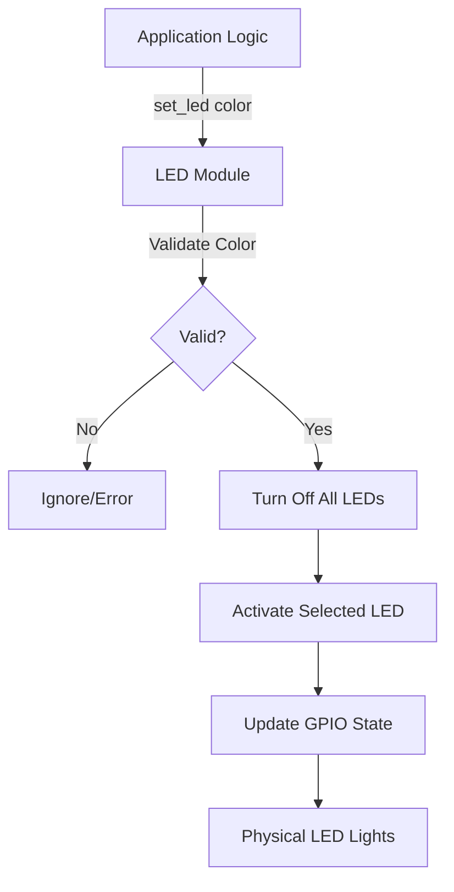

# Actors Overview

This section documents all actor modules used in the CPS HHBK system for controlling physical output devices.

## What Are Actors?

In cyber-physical systems, **actors** (also called **actuators**) are output devices that receive digital commands from the computer system and produce physical effects in the real world.



## Available Actors

### Visual Output

| Actor | Type | Interface | Function | Status |
|-------|------|-----------|----------|--------|
| [LED Controller](led.md) | RGB LEDs | GPIO | Visual temperature indication | ✅ Implemented |

## Actor Architecture

### Module Structure

All actor modules in the `actors/` directory follow a consistent pattern:

```python
# actors/<actor_name>.py

# Hardware initialization (module level)
device = HardwareInterface()

def control_<action>(parameters):
    """High-level control function"""
    # Validate parameters
    # Execute hardware commands
    # Update internal state

def selftest():
    """Hardware verification routine"""
    # Test all capabilities
    # Return status
```

### Design Principles

1. **Encapsulation**: Hide GPIO/hardware complexity
2. **State Management**: Track and validate device states
3. **Safety**: Ensure safe operation (no conflicts, limits)
4. **Testing**: Include self-test capabilities
5. **Documentation**: Clear API and behavior

## Actor Interfaces

### GPIO Output

The LED controller uses **GPIO (General Purpose Input/Output)** pins for digital output:

**Characteristics:**

- Binary states (HIGH/LOW, ON/OFF)
- 3.3V logic level on Raspberry Pi
- Software-controlled through gpiozero library
- Fast switching (microsecond response)

**Implementation:**

```python
from gpiozero import LED

led = LED(17)  # GPIO 17
led.on()       # Set HIGH (3.3V)
led.off()      # Set LOW (0V)
```

### PWM (Potential Future Use)

For variable brightness or motor speed control:

```python
from gpiozero import PWMLED

led = PWMLED(17)
led.value = 0.5  # 50% brightness
```

### Other Interfaces

Future actors might use:

- **I2C**: Servo controllers, displays
- **SPI**: High-speed DACs, motor drivers
- **Serial**: Modems, specialized devices

## Actor Control Flow



## Actor State Management

### Current State

The LED controller uses **module-level state**:

```python
# actors/led.py
green = LED()   # State stored in LED objects
yellow = LED()
red = LED()
```

**Advantages:**
- Simple implementation
- No explicit state tracking needed
- Hardware holds the state

**Disadvantages:**
- Can't query state without reading GPIO
- State lost on program exit
- No history or logging

### Improved State Management

For more complex systems:

```python
from enum import Enum
from typing import Optional

class LEDColor(Enum):
    GREEN = "green"
    YELLOW = "yellow"
    RED = "red"
    OFF = None

class LEDController:
    def __init__(self):
        self.leds = {
            LEDColor.GREEN: LED(17),
            LEDColor.YELLOW: LED(27),
            LEDColor.RED: LED(22)
        }
        self._current_state = LEDColor.OFF

    @property
    def state(self) -> LEDColor:
        """Get current LED state"""
        return self._current_state

    def set_color(self, color: LEDColor) -> None:
        """Set LED with state tracking"""
        # Turn off all
        for led in self.leds.values():
            led.off()

        # Activate selected
        if color != LEDColor.OFF:
            self.leds[color].on()

        # Update state
        self._current_state = color
```

## Adding New Actors

To add a new actor to the system:

### Step 1: Create Actor Module

```python
# actors/new_actor.py
"""
New Actor Module

Description of what the actor controls and how it works.
"""

from gpiozero import OutputDevice

# Initialize hardware
actuator = OutputDevice(pin_number)

def activate():
    """Turn on the actor"""
    actuator.on()

def deactivate():
    """Turn off the actor"""
    actuator.off()

def selftest():
    """Test actor functionality"""
    activate()
    sleep(1)
    deactivate()
```

### Step 2: Update Package

```python
# actors/__init__.py
from . import led
from . import new_actor

__all__ = ['led', 'new_actor']
```

### Step 3: Document

Create documentation:

```markdown
# docs/actors/new-actor.md
```

### Step 4: Integrate

Use in application:

```python
# main.py
import actors.new_actor

actors.new_actor.activate()
```

## Actor Safety

### Electrical Safety

**Current Limiting:**

Always use current-limiting resistors with LEDs:

```
GPIO → Resistor → LED → Ground
```

**Power Limits:**

Raspberry Pi GPIO limitations:

- **Per Pin**: 16mA maximum
- **All Pins**: 50mA total recommended
- **Protection**: No over-current protection built-in!

!!! danger "GPIO Damage Risk"
    Exceeding current limits can permanently damage GPIO pins!

### Software Safety

**Prevent Conflicts:**

```python
def set_led(color):
    # Turn off ALL first to prevent multiple LEDs on
    green.off()
    yellow.off()
    red.off()

    # Then activate only one
    if color == "green":
        green.on()
```

**Cleanup on Exit:**

```python
import atexit

def cleanup():
    """Turn off all actors on exit"""
    set_led(None)

atexit.register(cleanup)
```

**Exception Handling:**

```python
try:
    set_led("green")
except Exception as e:
    print(f"LED control failed: {e}")
    # Safe fallback
    cleanup()
```

## Actor Testing

### Self-Test

Every actor should include a self-test routine:

```python
def selftest():
    """Run LED self-test sequence"""
    set_led("green")
    sleep(1)
    set_led("yellow")
    sleep(1)
    set_led("red")
    sleep(1)
    set_led(None)
```

**Purpose:**
- Verify hardware connections
- Test all functions
- Visual confirmation
- Debugging aid

### Unit Tests

```python
# tests/test_actors.py
import unittest
from unittest.mock import Mock, patch
from actors import led

class TestLEDController(unittest.TestCase):

    @patch('actors.led.LED')
    def test_set_led_green(self, mock_led_class):
        """Test green LED activation"""
        led.set_led("green")

        # Verify green was turned on
        led.green.on.assert_called_once()

        # Verify others were turned off
        led.yellow.off.assert_called_once()
        led.red.off.assert_called_once()

    def test_selftest_executes(self):
        """Test self-test runs without error"""
        try:
            led.selftest()
        except Exception as e:
            self.fail(f"Self-test raised exception: {e}")
```

### Hardware Tests

```python
def test_led_hardware():
    """Interactive hardware test"""
    print("Testing LED hardware...")
    print("Watch the LEDs - they should light in sequence")

    input("Press Enter to test GREEN LED...")
    set_led("green")

    input("Press Enter to test YELLOW LED...")
    set_led("yellow")

    input("Press Enter to test RED LED...")
    set_led("red")

    input("Press Enter to turn OFF...")
    set_led(None)

    print("Hardware test complete!")
```

## Actor Patterns

### Pattern 1: One-at-a-Time

Current implementation - only one LED active:

```python
def set_led(color):
    all_off()
    activate_one(color)
```

**Use Case:** Status indicators, traffic lights

### Pattern 2: Independent Control

Each output controlled separately:

```python
def set_green(state):
    green.value = state

def set_yellow(state):
    yellow.value = state

def set_red(state):
    red.value = state
```

**Use Case:** Multiple independent indicators

### Pattern 3: Sequencing

Predefined sequences:

```python
def warning_flash():
    """Flash red LED as warning"""
    for _ in range(5):
        red.on()
        sleep(0.5)
        red.off()
        sleep(0.5)
```

**Use Case:** Alerts, animations

### Pattern 4: PWM Dimming

Variable brightness:

```python
from gpiozero import PWMLED

def set_led_brightness(color, level):
    """Set LED to specific brightness (0.0 to 1.0)"""
    leds[color].value = level
```

**Use Case:** Gradual transitions, analog-like output

## Performance Considerations

### Response Time

GPIO operations are very fast:

```python
import time

start = time.time()
led.on()
duration = time.time() - start

print(f"LED activation: {duration*1000000:.1f}µs")
# Typical: < 100µs
```

### Optimization

For high-frequency switching:

```python
# Bad: Repeated library calls
for i in range(1000):
    led.on()
    led.off()

# Better: Batch operations
import RPi.GPIO as GPIO
GPIO.setmode(GPIO.BCM)
GPIO.setup(17, GPIO.OUT)

for i in range(1000):
    GPIO.output(17, GPIO.HIGH)
    GPIO.output(17, GPIO.LOW)
```

## Best Practices

### ✅ Do:

- Use current-limiting resistors
- Implement self-test functions
- Clean up GPIO on exit
- Validate input parameters
- Document pin assignments
- Test on actual hardware
- Consider power consumption

### ❌ Don't:

- Exceed GPIO current limits
- Connect 5V signals to 3.3V pins
- Hot-swap components while powered
- Hard-code pin numbers
- Ignore error conditions
- Leave GPIOs in unknown states
- Forget cleanup routines

## Power Management

### Sleep Mode

Turn off all actors when idle:

```python
def sleep_mode():
    """Enter low-power mode"""
    set_led(None)
    # Other actors off
```

### Power Budget

Calculate total current draw:

```python
# Each LED: ~6mA with 220Ω resistor
# Total: 3 LEDs × 6mA = 18mA
# Well within 50mA GPIO budget
```

## Future Enhancements

Potential actor additions:

- **Buzzer**: Audio alerts
- **Relay**: Control high-power devices
- **Servo**: Physical movement
- **Display**: LCD/OLED for detailed info
- **Fan**: Active cooling based on temperature
- **Heater**: Temperature control (closed-loop)

## Related Documentation

- **[LED Controller](led.md)** - Detailed LED documentation
- **[API Reference](../api/actors.md)** - Complete API docs
- **[Hardware Setup](../hardware/overview.md)** - Wiring guide
- **[Troubleshooting](../troubleshooting.md)** - Common issues
