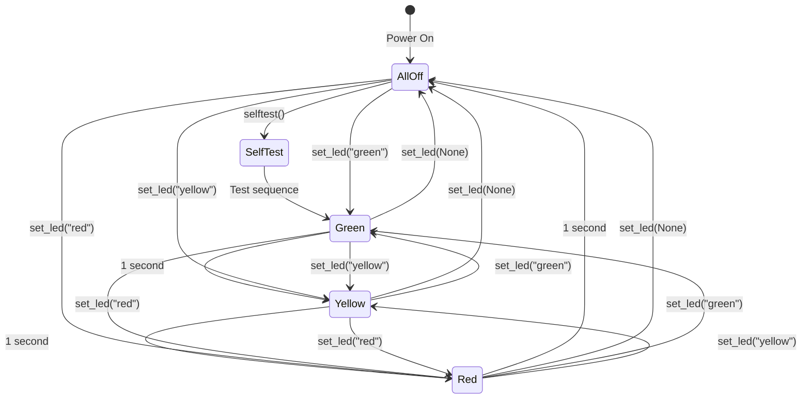

# LED Controller

The LED controller module provides visual feedback for the temperature monitoring system using three color-coded LEDs (green, yellow, red).

## Overview

The LED controller is an actor that translates temperature state into visual indicators, making the system status immediately apparent to users.

### Purpose

- **Visual Feedback**: Instant temperature status indication
- **User Interface**: No display needed
- **Color Coding**: Intuitive temperature ranges
- **Simple Control**: Easy software interface

## Hardware Components

### LED Specifications

| LED | Color | Forward Voltage | Current | GPIO Pin | Resistor |
|-----|-------|----------------|---------|----------|----------|
| Cool Status | Green | ~2.0V | 6-8mA | GPIO 17 | 220Ω |
| Warm Status | Yellow | ~2.0V | 6-8mA | GPIO 27 | 220Ω |
| Hot Status | Red | ~1.8V | 6-8mA | GPIO 22 | 220Ω |

!!! warning "GPIO Pin Configuration Required"
    The current code has **empty LED() constructors**. You must update `actors/led.py` with your actual GPIO pin numbers:
    ```python
    green = LED(17)   # Not LED()
    yellow = LED(27)
    red = LED(22)
    ```

### Circuit Diagram

```
    Raspberry Pi                     LEDs

GPIO 17 ───┬─── 220Ω ───┬──▶│──┬─── GND
           │              Green  │
GPIO 27 ───┼─── 220Ω ───┬──▶│──┤
           │             Yellow  │
GPIO 22 ───┘─── 220Ω ───┬──▶│──┤
                          Red    │
                                 │
                            Common GND
```

### Wiring

See [Wiring Guide](../hardware/wiring.md) for detailed connection instructions.

**Quick Reference:**

1. Connect LED anode (long leg) → 220Ω resistor → GPIO pin
2. Connect LED cathode (short leg) → Ground
3. Verify polarity (LEDs only work one direction!)

## API Reference

### Module: `actors.led`

#### Global Objects

```python
from gpiozero import LED

green = LED()   # GPIO pin needed!
yellow = LED()  # GPIO pin needed!
red = LED()     # GPIO pin needed!
```

!!! danger "Configuration Required"
    These LED objects are created without pin numbers. Update before use:
    ```python
    green = LED(17)
    yellow = LED(27)
    red = LED(22)
    ```

#### `set_led(color)`

Set LED to specified color, turning off all others.

**Signature:**
```python
def set_led(color: str) -> None
```

**Parameters:**
- `color` (str): LED color to activate
  - `"green"`: Activate green LED
  - `"yellow"`: Activate yellow LED
  - `"red"`: Activate red LED
  - `None` or other: Turn off all LEDs

**Returns:**
- None

**Behavior:**

1. Turns off all three LEDs
2. Turns on the specified LED (if valid)
3. Invalid colors result in all LEDs off

**Example:**
```python
from actors import led

# Turn on green LED
led.set_led("green")

# Turn on yellow LED
led.set_led("yellow")

# Turn on red LED
led.set_led("red")

# Turn off all LEDs
led.set_led(None)
```

**Implementation:**
```python
def set_led(color):
    """Sets the LED color based on the input string."""
    green.off()
    yellow.off()
    red.off()
    if color == "green":
        green.on()
    elif color == "yellow":
        yellow.on()
    elif color == "red":
        red.on()
```

**Algorithm:**

1. **Reset State**: Turn off all LEDs to prevent multiple on
2. **Validate Input**: Check if color is valid
3. **Activate**: Turn on only the specified LED
4. **Graceful Handling**: Invalid input = all off

#### `selftest()`

Run LED self-test sequence to verify hardware.

**Signature:**
```python
def selftest() -> None
```

**Parameters:**
- None

**Returns:**
- None

**Behavior:**

Cycles through all LED colors with 1-second delays:

1. Green ON for 1 second
2. Yellow ON for 1 second
3. Red ON for 1 second
4. All OFF

**Example:**
```python
from actors import led

# Run hardware test
led.selftest()
```

**Implementation:**
```python
def selftest():
    """Runs a self-test by cycling through the LED colors."""
    set_led("green")
    sleep(1)
    set_led("yellow")
    sleep(1)
    set_led("red")
    sleep(1)
    set_led(None)
```

**Use Cases:**

- **Initial Setup**: Verify wiring is correct
- **Debugging**: Check LEDs respond to commands
- **Demonstration**: Show system capabilities
- **Health Check**: Periodic hardware verification

## Usage Examples

### Basic Control

```python
import actors.led

# Cycle through colors
actors.led.set_led("green")
time.sleep(2)

actors.led.set_led("yellow")
time.sleep(2)

actors.led.set_led("red")
time.sleep(2)

# Turn off
actors.led.set_led(None)
```

### Temperature-Based Control

```python
import sensors.ky001
import actors.led

# Read temperature and set LED
temp_c = sensors.ky001.read_temp()[0]

if temp_c < 21:
    actors.led.set_led("green")
elif temp_c < 26:
    actors.led.set_led("yellow")
else:
    actors.led.set_led("red")
```

### Flash Warning

```python
import actors.led
import time

def flash_warning(times=5):
    """Flash red LED as warning"""
    for _ in range(times):
        actors.led.set_led("red")
        time.sleep(0.5)
        actors.led.set_led(None)
        time.sleep(0.5)

flash_warning()
```

### Startup Sequence

```python
import actors.led

def startup_sequence():
    """Visual startup indication"""
    # Fast cycle
    for _ in range(3):
        actors.led.set_led("green")
        time.sleep(0.2)
        actors.led.set_led("yellow")
        time.sleep(0.2)
        actors.led.set_led("red")
        time.sleep(0.2)

    # All off
    actors.led.set_led(None)

startup_sequence()
```

### Error Indication

```python
import actors.led

def indicate_error():
    """Flash red rapidly for error"""
    for _ in range(10):
        actors.led.set_led("red")
        time.sleep(0.1)
        actors.led.set_led(None)
        time.sleep(0.1)
```

## Integration with Main Application

### Current Implementation

From `main.py`:

```python
import actors.led
import sensors.ky001

def get_sensor_state():
    """Reads temperature and sets LED based on range."""
    temperature = sensors.ky001.read_temp()
    if temperature < 21:
        actors.led.set_led("green")
    elif temperature >= 26:
        actors.led.set_led("yellow")
    elif temperature >= 31:
        actors.led.set_led("red")

# Run self-test at startup
actors.led.selftest()
```

!!! bug "Logic Issue"
    The condition `elif temperature >= 31` is unreachable because `elif temperature >= 26` catches all values ≥26. This should be fixed:

    ```python
    def get_sensor_state():
        temperature = sensors.ky001.read_temp()[0]  # Get Celsius only
        if temperature < 21:
            actors.led.set_led("green")
        elif temperature < 26:
            actors.led.set_led("yellow")
        else:  # >= 26
            actors.led.set_led("red")
    ```

### Continuous Monitoring

```python
import time
import actors.led
import sensors.ky001

def monitor_temperature():
    """Continuous temperature monitoring with LED feedback"""
    actors.led.selftest()  # Verify hardware

    while True:
        try:
            temp_c = sensors.ky001.read_temp()[0]

            # Update LED based on temperature
            if temp_c < 21:
                actors.led.set_led("green")
            elif temp_c < 26:
                actors.led.set_led("yellow")
            else:
                actors.led.set_led("red")

            print(f"Temperature: {temp_c}°C")
            time.sleep(5)  # Update every 5 seconds

        except KeyboardInterrupt:
            print("\nShutting down...")
            actors.led.set_led(None)
            break
        except Exception as e:
            print(f"Error: {e}")
            # Flash error
            for _ in range(3):
                actors.led.set_led("red")
                time.sleep(0.2)
                actors.led.set_led(None)
                time.sleep(0.2)

if __name__ == "__main__":
    monitor_temperature()
```

## LED Behavior States

### State Diagram



### State Transitions

| Current State | Command | New State | Physical Action |
|---------------|---------|-----------|-----------------|
| All Off | `set_led("green")` | Green On | GPIO 17 HIGH |
| Green On | `set_led("yellow")` | Yellow On | GPIO 17 LOW, GPIO 27 HIGH |
| Yellow On | `set_led("red")` | Red On | GPIO 27 LOW, GPIO 22 HIGH |
| Any | `set_led(None)` | All Off | All GPIOs LOW |
| Any | `selftest()` | Cycle → Off | Sequential activation |

## gpiozero Library

### Why gpiozero?

The `gpiozero` library provides:

- **Simple API**: High-level, Pythonic interface
- **Abstraction**: Hides low-level GPIO complexity
- **Safety**: Automatic cleanup
- **Portability**: Works across Raspberry Pi models
- **Documentation**: Well-documented and maintained

### LED Class

```python
from gpiozero import LED

# Create LED object
led = LED(17)  # GPIO 17

# Control methods
led.on()       # Turn on (GPIO HIGH, 3.3V)
led.off()      # Turn off (GPIO LOW, 0V)
led.toggle()   # Switch state
led.blink()    # Automatic blinking

# Properties
led.is_lit     # True if on, False if off
led.pin        # Pin object
led.value      # 0 or 1
```

### Alternative: PWMLED

For variable brightness:

```python
from gpiozero import PWMLED

led = PWMLED(17)

# Brightness control (0.0 to 1.0)
led.value = 0.0   # Off
led.value = 0.25  # 25% brightness
led.value = 0.5   # 50% brightness
led.value = 1.0   # Full brightness

# Pulse effect
led.pulse()
```

## Troubleshooting

### LED Doesn't Light

**Possible Causes:**

1. **Incorrect Polarity**
   - LED is backwards (anode/cathode swapped)
   - Solution: Rotate LED 180°

2. **Missing Resistor**
   - LED might be damaged from overcurrent
   - Solution: Always use 220Ω resistor

3. **Wrong GPIO Pin**
   - Code doesn't match wiring
   - Solution: Verify pin numbers in code and hardware

4. **No GPIO Configuration**
   - `LED()` without pin number
   - Solution: Update code with `LED(17)`, etc.

5. **Faulty LED**
   - LED is burned out
   - Solution: Test with multimeter or replace

**Debugging Steps:**

```python
# Test LED directly
from gpiozero import LED

green = LED(17)
green.on()   # Should light up

# If not, try different pin
test = LED(17)
test.on()

# Check GPIO state
import RPi.GPIO as GPIO
GPIO.setmode(GPIO.BCM)
GPIO.setup(17, GPIO.OUT)
GPIO.output(17, GPIO.HIGH)  # Force high
```

### Wrong LED Lights Up

**Cause:** GPIO pin assignments don't match wiring

**Solution:**

1. Check physical wiring
2. Update code to match hardware
3. Or rewire to match code

### Multiple LEDs On

**Cause:** Logic error in `set_led()`

**Check:**
```python
# Should turn off all before activating one
def set_led(color):
    green.off()   # This line is critical
    yellow.off()  # This line is critical
    red.off()     # This line is critical

    # Then activate only one
    if color == "green":
        green.on()
```

### All LEDs Very Dim

**Possible Causes:**

1. **Wrong Resistor Value**
   - Too high resistance (>1kΩ)
   - Solution: Use 220Ω resistors

2. **Low Power Supply**
   - Insufficient current from power supply
   - Solution: Use quality 2.5A+ supply

3. **Long Wires**
   - Voltage drop over distance
   - Solution: Shorter wires or thicker gauge

### LEDs Flicker

**Possible Causes:**

1. **Loose Connection**
   - Intermittent contact
   - Solution: Secure all connections

2. **Power Supply Issue**
   - Voltage instability
   - Solution: Better power supply

3. **Software Rapid Switching**
   - Code switching too fast
   - Solution: Add delays between changes

## Advanced Usage

### Custom Colors (RGB LED)

If using a common cathode RGB LED:

```python
from gpiozero import RGBLED

led = RGBLED(red=22, green=17, blue=27)

# Color mixing
led.color = (1, 0, 0)      # Red
led.color = (0, 1, 0)      # Green
led.color = (0, 0, 1)      # Blue
led.color = (1, 1, 0)      # Yellow
led.color = (1, 0, 1)      # Magenta
led.color = (0, 1, 1)      # Cyan
led.color = (1, 1, 1)      # White
```

### Temperature Gradient

Smooth color transitions:

```python
from gpiozero import PWMLED

green_led = PWMLED(17)
yellow_led = PWMLED(27)
red_led = PWMLED(22)

def set_temperature_gradient(temp):
    """Smooth LED transition based on temperature"""
    if temp < 18:
        green_led.value = 1.0
        yellow_led.value = 0.0
        red_led.value = 0.0
    elif temp < 24:
        # Transition green to yellow
        ratio = (temp - 18) / 6
        green_led.value = 1.0 - ratio
        yellow_led.value = ratio
        red_led.value = 0.0
    elif temp < 30:
        # Transition yellow to red
        ratio = (temp - 24) / 6
        green_led.value = 0.0
        yellow_led.value = 1.0 - ratio
        red_led.value = ratio
    else:
        green_led.value = 0.0
        yellow_led.value = 0.0
        red_led.value = 1.0
```

## Best Practices

### ✅ Do:

- Update pin numbers before first use
- Use current-limiting resistors
- Test with `selftest()` on startup
- Turn off LEDs on program exit
- Validate color input
- Document pin assignments
- Check polarity before powering on

### ❌ Don't:

- Leave pin numbers empty in production
- Connect LEDs without resistors
- Exceed 16mA per GPIO pin
- Hot-swap LEDs while powered
- Use 5V for LEDs (use 3.3V)
- Ignore error conditions

## Performance

LED operations are very fast:

```python
import time

# Measure switching speed
start = time.time()
for _ in range(1000):
    led.on()
    led.off()
duration = time.time() - start

print(f"1000 toggles in {duration:.3f}s")
print(f"Toggle rate: {1000/duration:.0f} Hz")
# Typical: 5000-10000 Hz
```

## Related Documentation

- **[Actors Overview](index.md)** - All actors documentation
- **[API Reference](../api/actors.md)** - Complete API docs
- **[Hardware Wiring](../hardware/wiring.md)** - Connection guide
- **[Troubleshooting](../troubleshooting.md)** - Common issues
- **[gpiozero Documentation](https://gpiozero.readthedocs.io/)** - Library reference
