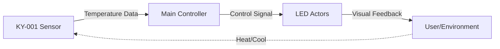
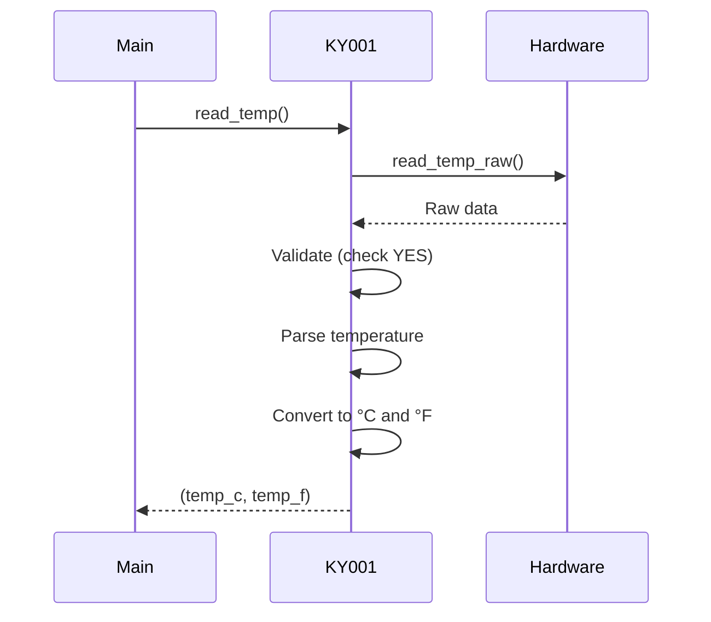
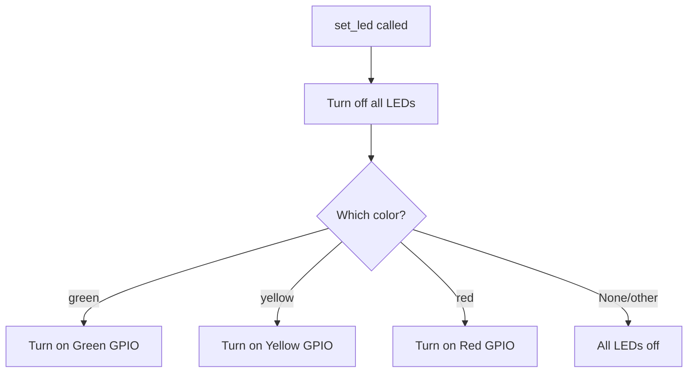
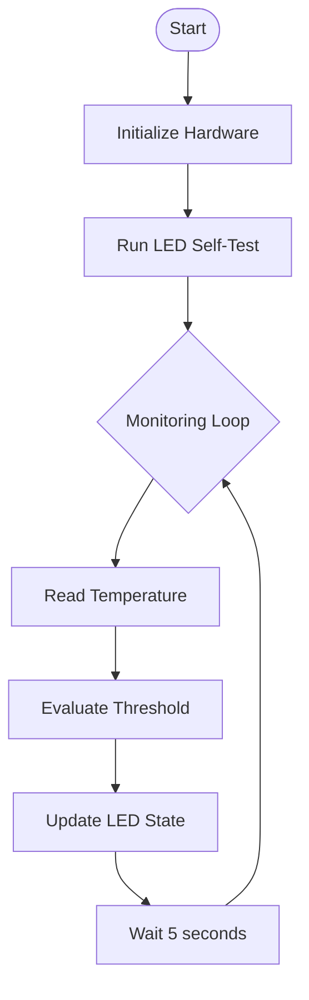
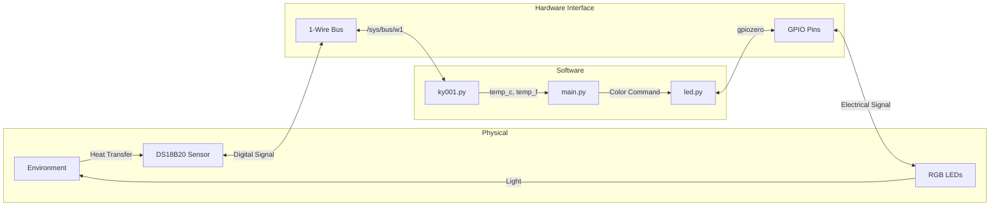

# How It Works

This page explains the operational flow and logic of the CPS HHBK temperature monitoring system.

## System Overview

The CPS HHBK system is a simple yet effective cyber-physical system that bridges the physical world (temperature) with digital control (LED indicators). It operates in a continuous sense-decide-act loop.



## Operational Flow

### 1. Temperature Sensing

The system continuously reads temperature from the KY-001 sensor via the 1-Wire protocol:



**Key Steps:**

1. **Raw Data Read**: Opens `/sys/bus/w1/devices/28-*/w1_slave` to read sensor data
2. **Validation**: Checks if the CRC is valid (line ends with "YES")
3. **Retry Logic**: If invalid, waits 200ms and retries
4. **Temperature Extraction**: Parses the temperature value (format: `t=23500` for 23.5°C)
5. **Conversion**: Calculates both Celsius and Fahrenheit values

### 2. Decision Logic

The main controller (`main.py`) implements a threshold-based decision algorithm:

```python
def get_sensor_state():
    temperature = sensors.ky001.read_temp()
    if temperature < 21:
        actors.led.set_led("green")
    elif temperature >= 26:
        actors.led.set_led("yellow")
    elif temperature >= 31:
        actors.led.set_led("red")
```

!!! note "Temperature Thresholds"
    The current implementation has three temperature zones:

    - **Cool Zone** (< 21°C): Green LED
    - **Warm Zone** (21-25°C): Yellow LED
    - **Hot Zone** (≥ 26°C): Red LED

!!! warning "Logic Issue"
    There's a logical issue in the current implementation - the condition `elif temperature >= 31` will never be reached because `elif temperature >= 26` catches all values ≥ 26. This should be reviewed and fixed.

### 3. LED Actuation

The LED controller manages GPIO pins to control LED states:



**LED Control Process:**

1. **Reset State**: All LEDs are turned off first
2. **Selective Activation**: Only the target LED is turned on
3. **GPIO Management**: Uses `gpiozero.LED` for clean GPIO abstraction

## Control Loop

### Current Implementation

The current implementation executes a single temperature check followed by a self-test:

```python
# main.py
actors.led.selftest()  # Runs once at startup
```

### Continuous Monitoring (Recommended)

For continuous monitoring, implement a control loop:

```python
import time
from main import get_sensor_state

while True:
    get_sensor_state()
    time.sleep(5)  # Check every 5 seconds
```



## System States

The system can be in one of the following states:

| State | Temperature | LED Status | GPIO State |
|-------|-------------|------------|------------|
| Cool | < 21°C | Green ON | GPIO 17: HIGH |
| Comfortable | 21-25°C | Yellow ON | GPIO 27: HIGH |
| Warm | ≥ 26°C | Red ON | GPIO 22: HIGH |
| Self-Test | N/A | Cycling | Sequential activation |
| Idle | N/A | All OFF | All GPIOs: LOW |

## Error Handling

### Sensor Errors

The `read_temp()` function handles sensor errors through validation:

```python
while lines[0].strip()[-3:] != 'YES':
    time.sleep(0.2)
    lines = read_temp_raw()
```

If the CRC check fails, the system retries indefinitely until a valid reading is obtained.

!!! danger "Infinite Loop Risk"
    If the sensor is disconnected or malfunctioning, this creates an infinite loop. Production code should implement a retry limit and error handling.

### GPIO Errors

GPIO errors (e.g., pin already in use, permission denied) are not currently handled and will cause the program to crash.

## Data Flow



## Performance Characteristics

- **Sensor Update Rate**: ~1-2 readings/second (limited by DS18B20 conversion time)
- **Response Time**: < 1 second from temperature change to LED update
- **Accuracy**: ±0.5°C (DS18B20 specification)
- **Resolution**: 0.001°C (software), 0.0625°C (hardware)

## Next Steps

- **[System Design](system-design.md)** - Architectural patterns and design decisions
- **[API Reference](../api/sensors.md)** - Detailed API documentation
- **[Hardware Setup](../hardware/overview.md)** - Physical implementation details
