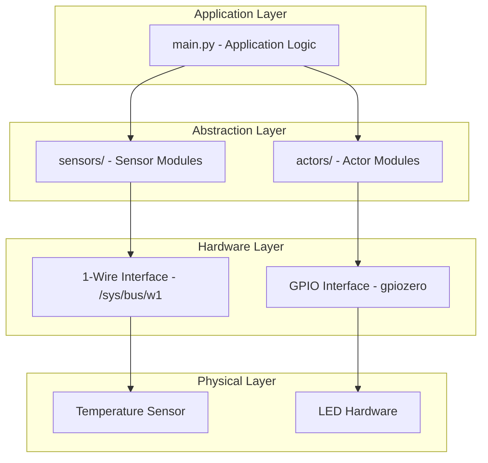
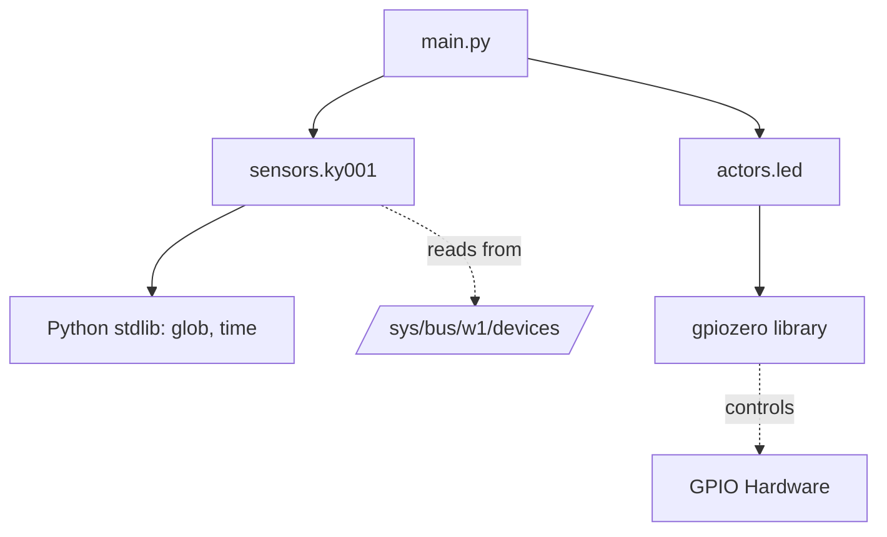
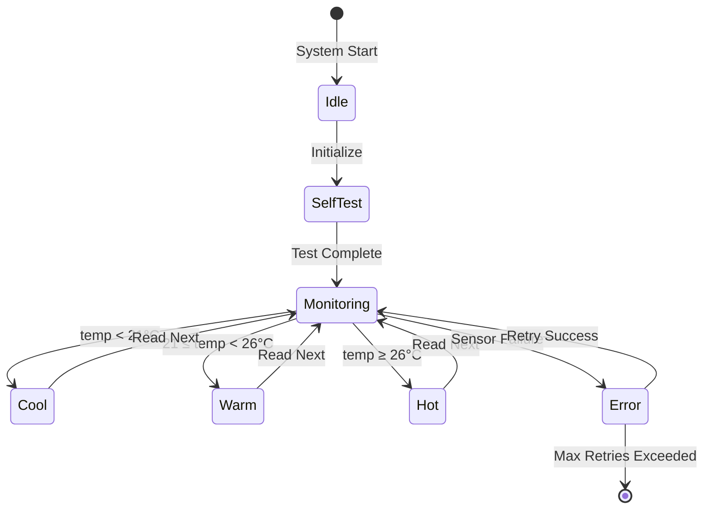

# System Design

This document describes the architectural decisions, design patterns, and structure of the CPS HHBK system.

## Architecture Overview

The system follows a **layered architecture** with clear separation of concerns:



## Design Patterns

### 1. Separation of Concerns

The codebase is organized into three main modules:

#### Sensors Module (`sensors/`)

**Responsibility**: Interface with input devices (sensors) and provide abstracted data

```python
# sensors/ky001.py
def read_temp():
    """Returns clean temperature data in both °C and °F"""
    # Handles low-level 1-Wire protocol
    # Validates data integrity
    # Converts raw values to meaningful units
```

**Benefits:**
- Encapsulates sensor-specific implementation details
- Easy to add new sensors without modifying main logic
- Testable in isolation

#### Actors Module (`actors/`)

**Responsibility**: Interface with output devices (actuators) and control them

```python
# actors/led.py
def set_led(color):
    """Controls LED state based on simple color command"""
    # Manages GPIO pin states
    # Ensures only one LED is active at a time
```

**Benefits:**
- Abstracts GPIO complexity from application logic
- Centralizes LED control logic
- Allows for easy hardware changes

#### Main Module (`main.py`)

**Responsibility**: Application logic and decision making

```python
def get_sensor_state():
    """Implements business logic for temperature monitoring"""
    # Reads sensor data
    # Makes decisions based on thresholds
    # Issues commands to actors
```

**Benefits:**
- Clean, readable business logic
- Easy to modify thresholds and behavior
- Independent of hardware implementation

### 2. Abstraction Layers

The system uses abstraction to hide implementation details:

```
Application Logic (main.py)
        ↓
    "set_led('green')"
        ↓
Actor Abstraction (led.py)
        ↓
    "green.on()"
        ↓
Hardware Library (gpiozero)
        ↓
    GPIO Pin Control
        ↓
Physical Hardware (LED)
```

### 3. Single Responsibility Principle

Each module has a single, well-defined purpose:

| Module | Responsibility | Input | Output |
|--------|---------------|-------|--------|
| `ky001.py` | Read temperature sensor | None | Temperature (°C, °F) |
| `led.py` | Control LED states | Color string | GPIO signals |
| `main.py` | Decision logic | Temperature | LED commands |

## Module Structure

### Project Organization

```
cps-hhbk/
├── sensors/              # Input device modules
│   ├── __init__.py      # Package initialization
│   ├── sensors.py       # Base sensor abstractions
│   └── ky001.py         # KY-001 specific implementation
├── actors/              # Output device modules
│   ├── __init__.py      # Package initialization
│   ├── actors.py        # Base actor abstractions
│   └── led.py           # LED controller implementation
├── main.py              # Application entry point
├── tests/               # Unit tests
│   └── tests.py
└── docs/                # Documentation
```

### Module Dependencies



**Key Observations:**

- Main module depends on both sensors and actors
- No circular dependencies
- External dependencies are minimal (Python stdlib + gpiozero)
- Hardware access is abstracted through OS interfaces

## Interface Design

### Sensor Interface

**Current Interface:**

```python
# sensors/ky001.py

def read_temp_raw() -> list[str]:
    """Low-level: Read raw sensor data"""

def read_temp() -> tuple[float, float]:
    """High-level: Get validated temperature in °C and °F"""
```

**Design Decisions:**

- Two-level API: raw data access and processed data
- Returns tuple for multiple units
- No parameters needed (sensor location is fixed)

**Potential Improvements:**

```python
class TemperatureSensor:
    """Base class for temperature sensors"""
    def read_celsius(self) -> float:
        raise NotImplementedError

    def read_fahrenheit(self) -> float:
        return self.read_celsius() * 9.0 / 5.0 + 32.0

class KY001(TemperatureSensor):
    """KY-001 specific implementation"""
    def __init__(self, device_id: str = None):
        self.device_id = device_id or self._auto_detect()
```

### Actor Interface

**Current Interface:**

```python
# actors/led.py

def set_led(color: str) -> None:
    """Set LED to specified color"""

def selftest() -> None:
    """Run LED self-test sequence"""
```

**Design Decisions:**

- String-based color specification (simple but not type-safe)
- Implicit state management (LEDs are module-level globals)
- No return value (fire-and-forget command)

**Potential Improvements:**

```python
from enum import Enum

class LEDColor(Enum):
    GREEN = "green"
    YELLOW = "yellow"
    RED = "red"
    OFF = None

class LEDController:
    """LED controller with explicit state management"""

    def __init__(self, green_pin: int, yellow_pin: int, red_pin: int):
        self.leds = {
            LEDColor.GREEN: LED(green_pin),
            LEDColor.YELLOW: LED(yellow_pin),
            LEDColor.RED: LED(red_pin)
        }
        self.current_state = LEDColor.OFF

    def set_color(self, color: LEDColor) -> None:
        """Set LED color with type safety"""

    def get_state(self) -> LEDColor:
        """Query current LED state"""
```

## Configuration Management

### Current Approach

Configuration is hardcoded in source files:

```python
# actors/led.py
green = LED()    # Pin number not specified!
yellow = LED()
red = LED()

# sensors/ky001.py
base_dir = '/sys/bus/w1/devices/'
device_folder = glob.glob(base_dir + '28*')[0]  # Auto-detect first sensor
```

### Recommended Approach

Use a configuration file:

=== "config.yaml"

    ```yaml
    gpio:
      leds:
        green: 17
        yellow: 27
        red: 22

    sensors:
      temperature:
        type: DS18B20
        device_id: "28-0000012345"
        bus: w1

    thresholds:
      cool: 21
      warm: 26
      hot: 31
    ```

=== "config.py"

    ```python
    import yaml

    def load_config(path: str = "config.yaml"):
        with open(path) as f:
            return yaml.safe_load(f)

    config = load_config()
    ```

## Error Handling Strategy

### Current State

- Minimal error handling
- Infinite retry loops in sensor reading
- No graceful degradation
- Crashes on GPIO errors

### Recommended Strategy

```python
import logging
from typing import Optional

logger = logging.getLogger(__name__)

class SensorError(Exception):
    """Base exception for sensor errors"""

class SensorTimeoutError(SensorError):
    """Raised when sensor doesn't respond in time"""

def read_temp_safe(max_retries: int = 10) -> Optional[tuple[float, float]]:
    """Read temperature with error handling"""
    for attempt in range(max_retries):
        try:
            return read_temp()
        except SensorError as e:
            logger.warning(f"Sensor read failed (attempt {attempt + 1}): {e}")
            if attempt == max_retries - 1:
                logger.error("Sensor read failed after all retries")
                return None
            time.sleep(0.5)
```

## State Management

### Current State

- Stateless sensor reads
- Implicit LED state (stored in GPIO hardware)
- No persistence of configuration or state

### State Diagram



## Scalability Considerations

### Adding New Sensors

To add a new sensor type:

1. Create new file in `sensors/` directory
2. Implement `read_<data>()` function
3. Import in `main.py`
4. Add to decision logic

Example for humidity sensor:

```python
# sensors/dht22.py
def read_humidity() -> float:
    """Read humidity from DHT22 sensor"""
    # Implementation

# main.py
import sensors.dht22

def get_sensor_state():
    temp = sensors.ky001.read_temp()[0]
    humidity = sensors.dht22.read_humidity()

    # Decision logic based on both values
```

### Adding New Actors

To add a new actor:

1. Create new file in `actors/` directory
2. Implement control functions
3. Import in `main.py`
4. Add to actuation logic

## Performance Optimization

### Current Performance

- **Sensor Read**: ~750ms (DS18B20 conversion time)
- **LED Update**: <1ms
- **Decision Logic**: <1ms
- **Total Cycle Time**: ~750ms

### Optimization Opportunities

1. **Parallel Sensor Reading**: Read multiple sensors concurrently
2. **Asynchronous I/O**: Use async/await for non-blocking operations
3. **Caching**: Cache sensor values with TTL
4. **Batch Updates**: Group multiple LED updates if needed

## Testing Strategy

### Unit Testing

Test each module in isolation:

```python
# tests/test_led.py
import unittest
from unittest.mock import Mock, patch

class TestLEDController(unittest.TestCase):
    @patch('actors.led.LED')
    def test_set_led_green(self, mock_led):
        """Test green LED activation"""
        set_led('green')
        # Assert green.on() was called
```

### Integration Testing

Test module interactions:

```python
# tests/test_integration.py
def test_temperature_to_led_flow():
    """Test complete flow from sensor to LED"""
    with patch('sensors.ky001.read_temp') as mock_sensor:
        mock_sensor.return_value = (20.0, 68.0)
        get_sensor_state()
        # Assert green LED was activated
```

### Hardware Testing

Test on actual hardware with known inputs.

## Security Considerations

### Current Risks

- No input validation on sensor data
- No authentication/authorization
- Direct GPIO access without safety checks
- No rate limiting

### Recommendations

1. **Input Validation**: Validate temperature readings are within physically possible range
2. **GPIO Safety**: Check pin availability before use
3. **Resource Cleanup**: Ensure GPIO pins are released on exit
4. **Logging**: Add security event logging

## Future Enhancements

### Potential Features

- [ ] Web dashboard for monitoring
- [ ] Data logging and historical trends
- [ ] Alert notifications (email, SMS)
- [ ] Multiple sensor support
- [ ] Configuration via web interface
- [ ] Auto-calibration
- [ ] Predictive alerts
- [ ] Integration with home automation systems

### Architectural Changes

- [ ] Move to event-driven architecture
- [ ] Implement MVC pattern
- [ ] Add database layer for persistence
- [ ] Separate sensor reading into background service
- [ ] REST API for remote control

## Related Documentation

- **[How It Works](how-it-works.md)** - Operational flow and logic
- **[API Reference](../api/sensors.md)** - Detailed API documentation
- **[Troubleshooting](../troubleshooting.md)** - Common issues and solutions
