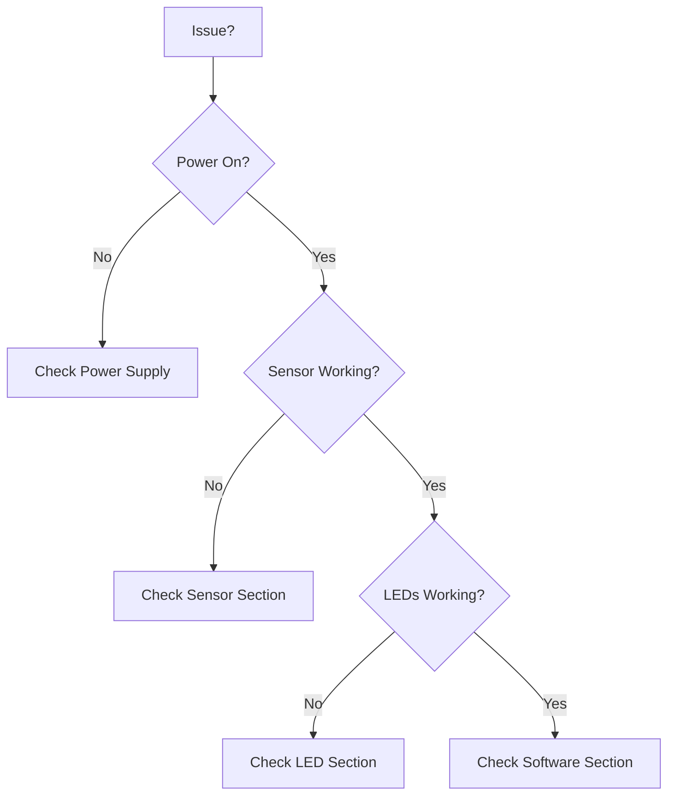

# Troubleshooting Guide

This guide helps diagnose and resolve common issues with the CPS HHBK temperature monitoring system.

## Quick Diagnostics

Start here for rapid issue identification:



## Sensor Issues

### Sensor Not Detected

**Symptom:** No device appears in `/sys/bus/w1/devices/`

**Diagnosis:**
```bash
# Check for 1-Wire devices
ls /sys/bus/w1/devices/

# Expected: 28-XXXXXXXXXXXX
# Actual: Only w1_bus_master1
```

**Solutions:**

=== "Check 1-Wire Enabled"

    Verify 1-Wire interface is enabled:

    ```bash
    # Check if modules are loaded
    lsmod | grep w1

    # Should see:
    # w1_gpio
    # w1_therm
    ```

    If not loaded:
    ```bash
    sudo raspi-config
    # Interface Options → 1-Wire → Enable
    sudo reboot
    ```

=== "Verify Wiring"

    Check physical connections:

    - [ ] VCC → 3.3V (not 5V!)
    - [ ] GND → Ground
    - [ ] DATA → GPIO 4 (Pin 7)
    - [ ] 4.7kΩ pull-up resistor between DATA and 3.3V

=== "Test Sensor"

    Test if sensor is functional:

    1. Try sensor on different GPIO pin
    2. Check with multimeter: VCC to GND should show ~3.3V
    3. Try different sensor if available

=== "Check Kernel Messages"

    Look for errors in system logs:

    ```bash
    dmesg | grep w1
    # Look for error messages

    # Manual module loading
    sudo modprobe w1-gpio
    sudo modprobe w1-therm
    ```

---

### Sensor Returns Invalid Data

**Symptom:** CRC check fails, `YES` never appears

**Diagnosis:**
```bash
cat /sys/bus/w1/devices/28-*/w1_slave

# Bad output:
# 00 00 00 00 00 00 00 00 00 : crc=00 NO
```

**Solutions:**

1. **Check pull-up resistor**
   - Must be 4.7kΩ ±10%
   - Connect between DATA and VCC
   - Some modules have built-in resistor

2. **Reduce cable length**
   - Long cables (>3m) can cause issues
   - Use shielded cable for long runs
   - Consider different pull-up value for long cables

3. **Check power supply**
   - Weak power causes unreliable readings
   - Use quality power supply (2.5A+ for Pi)
   - Verify 3.3V rail voltage

---

### Temperature Readings Incorrect

**Symptom:** Sensor reads but values are wrong

**Diagnosis:**
```python
import sensors.ky001
temp_c, temp_f = sensors.ky001.read_temp()
print(f"{temp_c}°C / {temp_f}°F")

# Reports 85°C (power-on reset value)
# Or unusual values
```

**Solutions:**

=== "Power-On Reset Value"

    85°C is the DS18B20 power-on default:

    ```python
    # Wait for first conversion
    import time
    time.sleep(1)  # Wait 1 second
    temp_c, temp_f = sensors.ky001.read_temp()
    ```

=== "Calibration Offset"

    Apply calibration if consistently off:

    ```python
    TEMP_OFFSET = -0.5  # Adjust as needed

    temp_c, temp_f = sensors.ky001.read_temp()
    temp_c += TEMP_OFFSET
    temp_f = temp_c * 9.0 / 5.0 + 32.0
    ```

=== "Validate Range"

    Check if reading is physically possible:

    ```python
    temp_c = sensors.ky001.read_temp()[0]

    if not (-50 <= temp_c <= 100):
        print(f"Invalid temperature: {temp_c}°C")
        # Retry or use last known good value
    ```

=== "Test Reference Points"

    Verify accuracy at known temperatures:

    - **Ice water**: Should read ~0°C
    - **Room temperature**: Should read ~20-25°C
    - **Body temperature**: Should read ~37°C

---

### Sensor Read Hangs

**Symptom:** `read_temp()` never returns, program freezes

**Cause:** CRC validation loop has no timeout

**Solutions:**

=== "Implement Timeout"

    Add timeout to sensor reading:

    ```python
    import sensors.ky001
    import signal

    class TimeoutError(Exception):
        pass

    def timeout_handler(signum, frame):
        raise TimeoutError("Sensor timeout")

    signal.signal(signal.SIGALRM, timeout_handler)
    signal.alarm(5)  # 5 second timeout

    try:
        temp = sensors.ky001.read_temp()
        signal.alarm(0)  # Cancel alarm
    except TimeoutError:
        print("Sensor read timed out")
    ```

=== "Check Connection"

    Verify sensor is physically connected:

    ```bash
    ls /sys/bus/w1/devices/28-*
    # If no output, sensor disconnected
    ```

=== "Add Retry Limit"

    Modify `read_temp()` to limit retries:

    ```python
    # In sensors/ky001.py
    def read_temp_safe(max_retries=10):
        lines = read_temp_raw()
        attempts = 0

        while lines[0].strip()[-3:] != 'YES':
            if attempts >= max_retries:
                raise TimeoutError("CRC validation failed")
            time.sleep(0.2)
            lines = read_temp_raw()
            attempts += 1

        # ... rest of function
    ```

---

## LED Issues

### No LED Response

**Symptom:** LEDs don't turn on

**Diagnosis:**
```python
import actors.led
actors.led.selftest()
# No LEDs light up
```

**Solutions:**

=== "Check GPIO Pin Configuration"

    **Problem:** LED objects created without pin numbers

    ```python
    # Current (broken):
    green = LED()

    # Fixed:
    green = LED(17)
    ```

    Update `actors/led.py`:
    ```python
    from gpiozero import LED

    green = LED(17)   # GPIO 17
    yellow = LED(27)  # GPIO 27
    red = LED(22)     # GPIO 22
    ```

=== "Verify Wiring"

    Check LED connections:

    - [ ] Anode (long leg) → Resistor → GPIO
    - [ ] Cathode (short leg) → Ground
    - [ ] 220Ω resistor present
    - [ ] Correct GPIO pins used

=== "Test LED Polarity"

    LEDs only work in one direction:

    ```
    Correct:  GPIO → Resistor → Anode → Cathode → GND
    Wrong:    GPIO → Resistor → Cathode → Anode → GND
    ```

    **Fix:** Rotate LED 180°

=== "Check Permissions"

    Verify GPIO access:

    ```bash
    # Add user to gpio group
    sudo usermod -a -G gpio $USER

    # Logout and login again
    # Or:
    newgrp gpio
    ```

=== "Test Directly"

    Bypass LED module:

    ```python
    from gpiozero import LED

    test_led = LED(17)
    test_led.on()
    # LED should light

    test_led.off()
    ```

---

### Wrong LED Lights Up

**Symptom:** Calling `set_led("green")` lights yellow or red

**Cause:** GPIO pin mismatch between code and wiring

**Solutions:**

1. **Option A: Fix Code**
   ```python
   # Update actors/led.py to match wiring
   green = LED(actual_green_pin)
   yellow = LED(actual_yellow_pin)
   red = LED(actual_red_pin)
   ```

2. **Option B: Fix Wiring**
   - Rewire LEDs to match code
   - GPIO 17 → Green
   - GPIO 27 → Yellow
   - GPIO 22 → Red

3. **Document Current Config**
   ```python
   # actors/led.py
   # LED Configuration:
   # Green:  GPIO 17 (Physical Pin 11)
   # Yellow: GPIO 27 (Physical Pin 13)
   # Red:    GPIO 22 (Physical Pin 15)

   green = LED(17)
   yellow = LED(27)
   red = LED(22)
   ```

---

### LEDs Very Dim

**Symptom:** LEDs work but are barely visible

**Solutions:**

=== "Wrong Resistor Value"

    **Problem:** Resistor too large (>500Ω)

    **Solution:** Use 220Ω resistors

    ```
    Current = (3.3V - 2.0V) / R

    With 1kΩ:  I = 1.3mA  (very dim)
    With 220Ω: I = 6mA    (good brightness)
    With 100Ω: I = 13mA   (bright)
    ```

=== "Power Supply Issue"

    **Problem:** Insufficient current from power supply

    **Check:**
    ```bash
    vcgencmd get_throttled
    # 0x0 = OK
    # Other = Under-voltage detected
    ```

    **Solution:** Use quality 2.5A+ power supply

=== "Long Wires"

    **Problem:** Voltage drop over wire length

    **Solution:**
    - Use shorter wires
    - Use thicker gauge wire
    - Place breadboard closer to Pi

---

### Multiple LEDs On Simultaneously

**Symptom:** More than one LED lights at once

**Cause:** Logic error in `set_led()`

**Check Implementation:**
```python
def set_led(color):
    # These lines MUST be present:
    green.off()
    yellow.off()
    red.off()

    # Then activate only one
    if color == "green":
        green.on()
    elif color == "yellow":
        yellow.on()
    elif color == "red":
        red.on()
```

**Verify:**
```python
import actors.led

# Test each color individually
actors.led.set_led("green")
# Only green should be on

actors.led.set_led("yellow")
# Only yellow should be on
```

---

## Software Issues

### Module Import Errors

**Symptom:** `ImportError: No module named 'gpiozero'`

**Solution:**
```bash
# Install gpiozero
pip3 install gpiozero

# Or with apt
sudo apt install python3-gpiozero
```

---

### Module Not Found: sensors/actors

**Symptom:** `ModuleNotFoundError: No module named 'sensors'`

**Solutions:**

=== "Wrong Directory"

    Run from project root:
    ```bash
    cd /path/to/cps-hhbk
    python3 main.py
    ```

=== "PYTHONPATH Issue"

    Add project to Python path:
    ```bash
    export PYTHONPATH="${PYTHONPATH}:/path/to/cps-hhbk"
    python3 main.py
    ```

=== "Missing __init__.py"

    Ensure package files exist:
    ```bash
    touch sensors/__init__.py
    touch actors/__init__.py
    ```

---

### Permission Denied Errors

**Symptom:** `PermissionError: [Errno 13] Permission denied`

**Solutions:**

=== "GPIO Access"

    Add user to gpio group:
    ```bash
    sudo usermod -a -G gpio $USER
    logout  # Then login again
    ```

=== "1-Wire Access"

    Check file permissions:
    ```bash
    ls -l /sys/bus/w1/devices/28-*/w1_slave
    # Should be readable by all

    # If not:
    sudo chmod a+r /sys/bus/w1/devices/28-*/w1_slave
    ```

=== "Run as Root (Not Recommended)"

    Last resort only:
    ```bash
    sudo python3 main.py
    ```

---

### Logic Error in main.py

**Symptom:** LED behavior doesn't match temperature

**Issue:** Unreachable condition in `main.py`:

```python
# BROKEN CODE:
if temperature < 21:
    actors.led.set_led("green")
elif temperature >= 26:
    actors.led.set_led("yellow")
elif temperature >= 31:  # ← UNREACHABLE!
    actors.led.set_led("red")
```

**Fix:**
```python
# CORRECTED CODE:
temp_c = sensors.ky001.read_temp()[0]

if temp_c < 21:
    actors.led.set_led("green")
elif temp_c < 26:
    actors.led.set_led("yellow")
else:  # >= 26
    actors.led.set_led("red")
```

---

## Hardware Issues

### Raspberry Pi Won't Boot

**Symptoms:**
- No LED activity on Pi
- No video output
- Red power LED on, green activity LED off

**Solutions:**

=== "Power Supply"

    **Problem:** Insufficient power

    **Check:**
    - Use 2.5A+ supply
    - Official Raspberry Pi power supply recommended
    - Quality USB cable (not thin charging cable)

    **Test:**
    ```bash
    # After booting, check throttling
    vcgencmd get_throttled
    ```

=== "SD Card"

    **Problem:** Corrupted or missing OS

    **Solutions:**
    1. Re-image SD card with Raspberry Pi Imager
    2. Use quality SD card (Class 10, A1 rating)
    3. Check SD card is fully inserted

=== "Short Circuit"

    **Problem:** Hardware short circuit

    **Diagnosis:**
    1. Disconnect all external connections
    2. Try booting with only power
    3. If boots, reconnect components one at a time

---

### Raspberry Pi Shuts Down Randomly

**Symptom:** Pi reboots or shuts down unexpectedly

**Solutions:**

=== "Under-Voltage"

    **Check:**
    ```bash
    vcgencmd get_throttled
    # 0x50000 = Under-voltage occurred
    ```

    **Fix:**
    - Use better power supply (2.5A minimum, 3A recommended)
    - Shorter/thicker power cable
    - Remove high-power USB devices

=== "Overheating"

    **Check:**
    ```bash
    vcgencmd measure_temp
    # Should be < 80°C
    ```

    **Fix:**
    - Add heatsinks
    - Improve ventilation
    - Use cooling fan
    - Reduce CPU load

=== "SD Card Corruption"

    **Symptoms:**
    - Random errors
    - File system read-only

    **Fix:**
    ```bash
    # Backup and re-image SD card
    # Enable journaling
    ```

---

## Diagnostic Tools

### System Information

```bash
# Raspberry Pi model
cat /proc/device-tree/model

# OS version
cat /etc/os-release

# Kernel version
uname -a

# CPU temperature
vcgencmd measure_temp

# Voltage
vcgencmd measure_volts

# Memory
free -h

# Disk space
df -h
```

### GPIO Testing

```bash
# Install gpio utilities
sudo apt install raspi-gpio

# Check GPIO state
raspi-gpio get 17  # Check GPIO 17

# Set GPIO for testing
raspi-gpio set 17 op  # Output
raspi-gpio set 17 dh  # Drive high
raspi-gpio set 17 dl  # Drive low
```

### 1-Wire Testing

```bash
# List modules
lsmod | grep w1

# Load modules manually
sudo modprobe w1-gpio
sudo modprobe w1-therm

# Check kernel messages
dmesg | grep w1

# Read sensor directly
cat /sys/bus/w1/devices/28-*/w1_slave
```

### Python Diagnostics

```python
#!/usr/bin/env python3
"""Diagnostic script for CPS HHBK system"""

import sys
print(f"Python version: {sys.version}")

# Test imports
try:
    import gpiozero
    print(f"✓ gpiozero version: {gpiozero.__version__}")
except ImportError:
    print("✗ gpiozero not installed")

try:
    import sensors.ky001
    print("✓ sensors.ky001 module found")
except ImportError as e:
    print(f"✗ sensors.ky001 import failed: {e}")

try:
    import actors.led
    print("✓ actors.led module found")
except ImportError as e:
    print(f"✗ actors.led import failed: {e}")

# Test sensor
try:
    temp_c, temp_f = sensors.ky001.read_temp()
    print(f"✓ Sensor reading: {temp_c}°C / {temp_f}°F")
except Exception as e:
    print(f"✗ Sensor read failed: {e}")

# Test LEDs
try:
    actors.led.selftest()
    print("✓ LED selftest completed")
except Exception as e:
    print(f"✗ LED test failed: {e}")
```

Save as `diagnostic.py` and run:
```bash
python3 diagnostic.py
```

---

## Getting Help

If issues persist:

### 1. Gather Information

```bash
# Create diagnostic report
{
    echo "=== System Info ==="
    cat /proc/device-tree/model
    uname -a

    echo -e "\n=== 1-Wire Devices ==="
    ls -la /sys/bus/w1/devices/

    echo -e "\n=== GPIO State ==="
    raspi-gpio get 4,17,22,27

    echo -e "\n=== Kernel Messages ==="
    dmesg | tail -50

    echo -e "\n=== Python Version ==="
    python3 --version

    echo -e "\n=== Installed Packages ==="
    pip3 list | grep -i gpio
} > diagnostic_report.txt
```

### 2. Check Documentation

- **[Getting Started](getting-started.md)** - Setup instructions
- **[Hardware Setup](hardware/overview.md)** - Wiring guide
- **[API Reference](api/sensors.md)** - Code documentation

### 3. Community Resources

- [Raspberry Pi Forums](https://forums.raspberrypi.com/)
- [gpiozero Documentation](https://gpiozero.readthedocs.io/)
- [DS18B20 Datasheet](https://www.maximintegrated.com/en/products/sensors/DS18B20.html)

### 4. Report Issues

If you found a bug, report it on the [GitHub repository](https://github.com/Maxjr2/cps-hhbk/issues) with:

- Diagnostic report
- Steps to reproduce
- Expected vs actual behavior
- Photos of hardware setup

---

## Common Error Messages

### Quick Reference

| Error Message | Likely Cause | Solution |
|---------------|--------------|----------|
| `No module named 'gpiozero'` | Missing dependency | `pip3 install gpiozero` |
| `Permission denied` | GPIO access | Add user to gpio group |
| `No such file or directory: /sys/bus/w1/devices/28-*` | Sensor not detected | Enable 1-Wire, check wiring |
| `Pin already in use` | GPIO conflict | Release pin or reboot |
| `list index out of range` | Sensor data format issue | Check sensor connection |
| Hangs on `read_temp()` | CRC validation failing | Check pull-up resistor |

---

## Prevention

### Regular Maintenance

```bash
# Monthly checks
vcgencmd measure_temp     # Check temperature
vcgencmd get_throttled    # Check for issues
df -h                     # Check disk space
sudo apt update && sudo apt upgrade  # Update system
```

### Best Practices

- ✅ Use quality power supply
- ✅ Properly shutdown (don't pull power)
- ✅ Keep system updated
- ✅ Document any changes
- ✅ Test after modifications
- ✅ Back up working configurations

---

## Still Stuck?

Create a detailed issue report:

```markdown
## Environment
- Raspberry Pi Model: [e.g., Pi 4 Model B]
- OS Version: [output of `cat /etc/os-release`]
- Python Version: [output of `python3 --version`]

## Problem Description
[Describe what's happening]

## Steps to Reproduce
1. [Step 1]
2. [Step 2]
3. [Error occurs]

## Expected Behavior
[What should happen]

## Actual Behavior
[What actually happens]

## Diagnostic Output
```
[Paste output of diagnostic.py]
```

## Photos
[Attach photos of wiring]
```

Post this to the [GitHub Issues](https://github.com/Maxjr2/cps-hhbk/issues) page.
